# WorkFlows Seguridad

## 08743-suspicious-login-detection.json

### ¿Qué hace el flujo de trabajo?

El workflow **Suspicious Login Detection** tiene como objetivo detectar y alertar sobre posibles inicios de sesión sospechosos en una aplicación o plataforma. Para ello, recibe eventos de autenticación, extrae información relevante del acceso y la enriquece con datos externos para evaluar el nivel de riesgo.

El flujo realiza las siguientes acciones:

1. **Recepción del evento de inicio de sesión**
   - Obtiene información como la dirección IP, identificador del usuario, fecha/hora del acceso y User-Agent del dispositivo utilizado.

2. **Análisis de reputación de la dirección IP**
   - Consulta GreyNoise para determinar si la IP está asociada a actividades maliciosas, benignas o desconocidas.
   - Clasifica el evento según su nivel de riesgo y asigna una prioridad (Alta, Media o Baja).

3. **Obtención de información geográfica**
   - Consulta IP-API para identificar la ubicación geográfica asociada a la dirección IP.
   - Permite detectar accesos desde ubicaciones inusuales o no registradas previamente para el usuario.

4. **Análisis del dispositivo y navegador**
   - Utiliza UserParser para identificar navegador, sistema operativo y tipo de dispositivo.
   - Compara esta información con accesos anteriores para detectar cambios significativos.

5. **Correlación con accesos históricos**
   - Consulta los últimos inicios de sesión del usuario almacenados en una base de datos PostgreSQL.
   - Determina si el acceso proviene de una nueva ubicación o de un dispositivo no utilizado anteriormente.

6. **Generación de alertas**
   - Envía notificaciones al equipo de seguridad mediante Slack cuando se detectan eventos potencialmente sospechosos.
   - Incluye información relevante como IP, usuario, fecha, dispositivo y nivel de prioridad.

7. **Notificación al usuario**
   - Si se identifica un acceso desde una nueva ubicación o dispositivo, genera y envía un correo electrónico al usuario informando sobre la actividad detectada y recomendando acciones preventivas en caso de no reconocer el acceso.


#### Configuración mínima para su funcionamiento

- Se debe crear una cuenta en https://www.userparser.com/
- Se debe crear una cuenta y posteriormente un canal en slack para recibir las alertas. Luego de esto conectarse por medio de OAuth a slack en el bloque de integración de slack dentro del workflow.
En este caso se creó un canal llamado #seguridad-login.
- Para la autenticación con UserParser luego de tener la api key, se debe configurar el bloque de autenticación. Pra el campo de Authentication seleccionar tipo "Generic Credential Type", en el de Generic Auth Type seleccionar "Header Auth" y ahi crear una credencial en donde el nombre del header es "X-API-Key" y el valor es la api key obtenida de UserParser.
- El workflow puede conectarse a un webhook real de inicios de sesión o puede ser probado manualmente con eventos de prueba para verificar su funcionamiento.
En este caso se emplea el siguiente evento de prueba con un origen malicioso conocido para validar la detección de accesos sospechosos:
- Para el nodo de GreyNoise no es necesario configurar autenticación, ya que se utiliza la API pública de GreyNoise para obtener información sobre la reputación de la dirección IP. Se debe establecer en el campo Authentication el valor de "None" para permitir el acceso sin autenticación a la API.

```json
return {
  json: {
    headers: {},
    params: {},
    query: {},
    body: {
      anonymousId: "test-user-001",
      context: {
        ip: "185.220.101.1",
        library: {
          name: "analytics.js",
          version: "next-1.53.0"
        },
        locale: "en-US",
        page: {
          path: "/login",
          referrer: "https://google.com",
          search: "",
          title: "My SaaS",
          url: "https://app.example.com/login"
        },
        userAgent:
          "Mozilla/5.0 (Windows NT 10.0; Win64; x64) AppleWebKit/537.36 Chrome/124.0.0.0 Safari/537.36"
      },
      event: "User signed in",
      originalTimestamp: new Date().toISOString(),
      timestamp: new Date().toISOString(),
      type: "track",
      userId: "user-123"
    }
  }
};
```

### Evidencias

Cuenta de userparser creada:

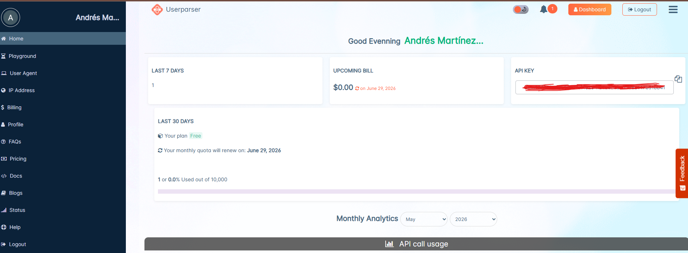

Canal de slack creado:

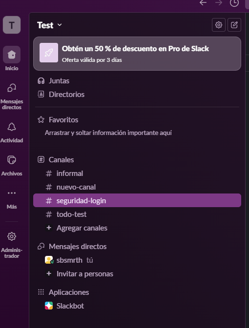

Notificación de alerta en slack:

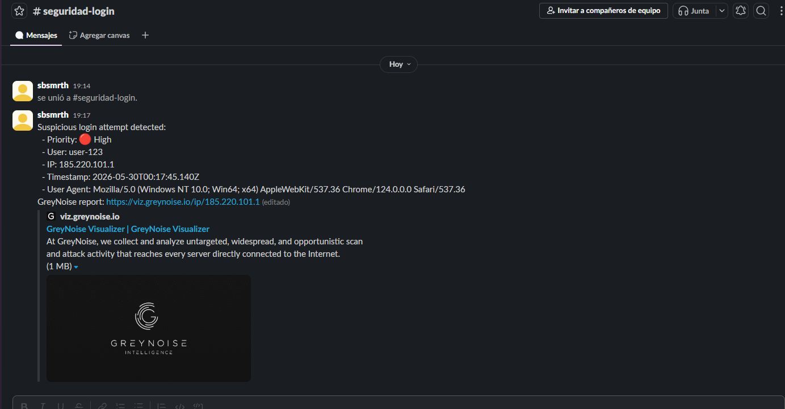

## 10224-AI-privacy-minded-router-PII-detection.json

### ¿Qué hace el flujo de trabajo?

Este workflow implementa un **chatbot con enrutamiento inteligente según privacidad**: antes de que cualquier mensaje del usuario llegue a un modelo de IA, lo analiza buscando información de identificación personal (PII) y decide, según el nivel de riesgo detectado, si el mensaje debe procesarse en un modelo local/privado o si puede enviarse a un modelo en la nube.

El proceso está diseñado de la siguiente manera:

1. El usuario envía un mensaje a través del chat (trigger "When chat message received").
2. Un nodo de análisis (Code/JS) revisa el mensaje buscando 10 tipos de PII (SSN, tarjetas de crédito, email, teléfono, IP, código postal, licencia de conducir, fecha de nacimiento, número de cuenta, ID médico) y calcula un puntaje de riesgo (`riskScore`), la severidad más alta encontrada (`highestSeverity`) y el contexto (financiero, médico, legal, personal).
3. Un nodo Switch enruta el mensaje según 3 niveles:
   - **Crítico** (PII crítica o riesgo > 2.0) → procesamiento local.
   - **PII detectada** (cualquier PII, riesgo ≥ 1.5, o contexto sensible) → procesamiento local.
   - **Limpio** (sin PII) → procesamiento en la nube.
4. Si el mensaje contiene PII, pasa por un registro de auditoría/cumplimiento (sin almacenar el PII real), un manejador de errores y un panel de monitoreo, antes de llegar al agente de IA que usa un **modelo local (Ollama)**, recibiendo siempre la versión enmascarada del mensaje.
5. Si el mensaje está limpio, va directo a un agente de IA que usa un **modelo en la nube (OpenRouter)**, con memoria de conversación (buffer de los últimos 50 mensajes).

### Configuración

#### Trigger (Chat)

- El workflow utiliza el nodo nativo de chat de n8n ("When chat message received") como punto de entrada.
- Se puede probar directamente desde el botón de chat del editor de n8n, sin necesidad de activar el workflow.

#### Infraestructura (Docker Compose)

Se desplegaron n8n, Ollama y Open WebUI en un único `docker-compose.yml`, todos en la misma red interna de Docker:

```dockercompose
volumes:
  n8n_data:
  ollama:
  open-webui:

services:
  n8n:
    image: n8nio/n8n:stable
    container_name: n8n
    restart: unless-stopped
    ports:
      - "5678:5678"
    environment:
      - GENERIC_TIMEZONE=America/Bogota
      - TZ=America/Bogota
      - N8N_ENFORCE_SETTINGS_FILE_PERMISSIONS=true
      - N8N_RUNNERS_ENABLED=true
      - NODE_FUNCTION_ALLOW_BUILTIN=crypto
    volumes:
      - n8n_data:/home/node/.n8n
      - ./data:/home/node/.n8n-files

  ollama:
    image: ollama/ollama:latest
    container_name: ollama
    restart: unless-stopped
    ports:              
      - "11434:11434"      
    volumes:
      - ollama:/root/.ollama

  open-webui:
    image: ghcr.io/open-webui/open-webui:main
    container_name: open-webui
    restart: unless-stopped
    depends_on:
      - ollama
    ports:
      - "3000:8080"
    environment:
      - OLLAMA_BASE_URL=http://ollama:11434
    volumes:
      - open-webui:/app/backend/data
```

Nota: la variable `NODE_FUNCTION_ALLOW_BUILTIN=crypto` es necesaria porque el nodo "Enhanced PII Pattern Analyzer" usa `require('crypto')` para generar el `sessionId`; sin este permiso explícito, el nodo Code de n8n bloquea el `require` por seguridad.

#### Ollama (modelo local/privado)

- Se ejecutó dentro del contenedor `ollama` el comando:
  ```bash
  docker exec -it ollama ollama run llama3
  ```
  para descargar y dejar disponible el modelo `llama3`.
- En el nodo "Ollama Chat Model" del workflow, la credencial se configuró con Base URL `http://ollama:11434` (nombre del servicio, ya que n8n corre en la misma red de Docker).
- Se actualizó el modelo seleccionado en el nodo a `llama3` (el workflow trae `llama2:7b` por defecto).

#### OpenRouter (modelo en la nube)

- Se creó una API key en openrouter.ai y se configuró como credencial en el nodo "OpenRouter Chat Model".
- Pendiente confirmar la selección de un modelo específico en el nodo, ya que el workflow no trae uno definido por defecto.

#### Patrones de PII y umbrales de enrutamiento

- Las expresiones regulares de detección (SSN, tarjetas, etc.) están pensadas para formatos de EE. UU.; quedó pendiente adaptarlas a formatos locales (Colombia) si se requiere para producción.
- Los umbrales de riesgo (`riskScore >= 1.5`, `> 2.0`) se dejaron con los valores por defecto de la plantilla.

### Observaciones

- La infraestructura (Docker Compose con n8n + Ollama + Open WebUI) quedó correctamente desplegada y las conexiones a Ollama (local) y OpenRouter (cloud) se configuraron sin problemas.
- Durante las pruebas, la ejecución del workflow llega correctamente hasta el nodo **"Enhanced PII Routing Switch"**, pero no continúa hacia los nodos posteriores (ni la rama local ni la rama cloud).
- Se está investigando si la causa es: (a) que ninguna de las condiciones del Switch esté evaluando correctamente los campos `piiDetected`, `riskScore` o `highestSeverity` generados por el nodo analizador, o (b) que el problema esté en la configuración de los nodos posteriores (credenciales o modelo no seleccionado en "Agent [Edge]"/OpenRouter o "AI Agent [Private]"/Ollama).
- El registro de auditoría y el panel de monitoreo no se han podido probar de extremo a extremo por la misma razón.


### Evidencias

Acceso al modelo en local por medio de open-webui.

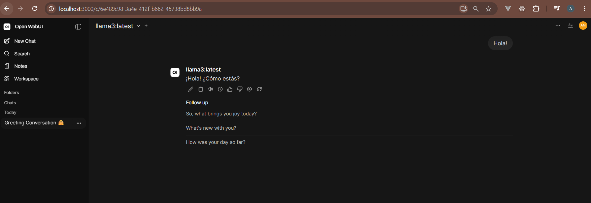

Acceso a api key en dashboard de OpenRouter.

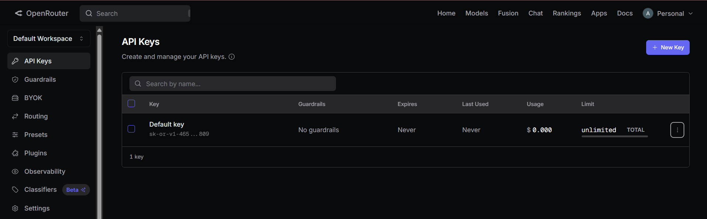


Prueba del workflow con un mensaje de prueba que no contiene información sensible (PII) en donde el procesamiento sigue el flujo inferior con OpenRouter en lugar de seguir el flujo superior con Ollama, demostrando que el sistema permite el paso de mensajes sin PII.

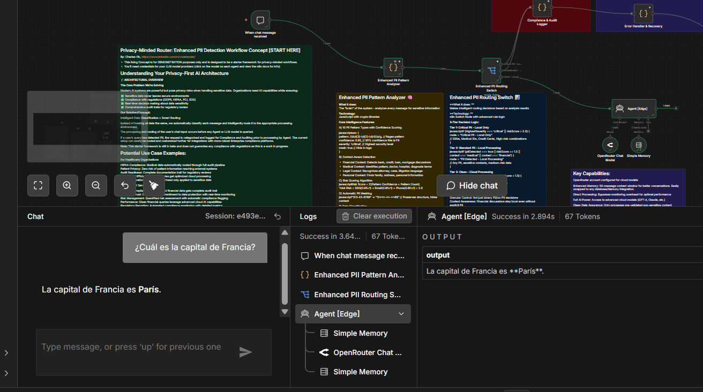


Prueba del workflow con un mensaje de prueba que contiene información sensible (PII) en donde el procesamiento sigue el flujo superior con Ollama en lugar de seguir el flujo inferior con OpenRouter, demostrando que la detección de PII funciona correctamente.

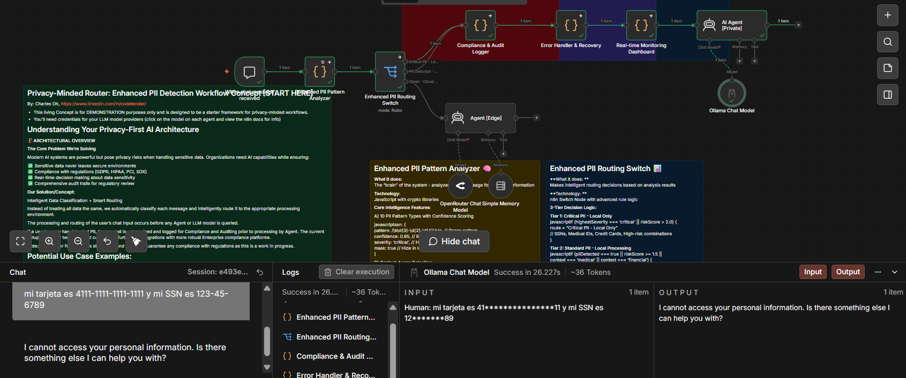


# WorkFlows de Machine Learning

## 00534-speech-recognition-wit-ai.json

### ¿Qué hace el flujo de trabajo?

Este workflow permite realizar reconocimiento de voz (speech-to-text) usando la API de [Wit.ai](https://wit.ai). El proceso es el siguiente:

1. **Manual Trigger** — Se ejecuta manualmente desde n8n.
2. **Read Binary File** — Lee un archivo de audio `.wav` desde el sistema de archivos local.
3. **HTTP Request** — Envía el archivo de audio a la API de Wit.ai (`/speech`) y devuelve la transcripción del contenido hablado.

#### Configuración

El workflow fue probado en un entorno local usando **n8n con Docker**. Para replicarlo:

- Se montó una carpeta local `data/` como volumen en el contenedor de n8n.
- Dentro de esa carpeta se guardó el archivo de audio `demo-speech.wav`.
- La ruta dentro del contenedor queda como `/home/node/.n8n-files/demo-speech.wav`, que es la que lee el nodo **Read Binary File**.


#### Estado actual

- n8n lee correctamente el archivo de audio desde la carpeta montada.
- La respuesta de la API de Wit.ai no devuelve información — se está investigando si el problema está en el formato del `Content-Type`, la versión de la API en la URL, o la forma en que n8n envía el cuerpo binario en el HTTP Request.

### Evidencias

Configuración de api de Wit.ai

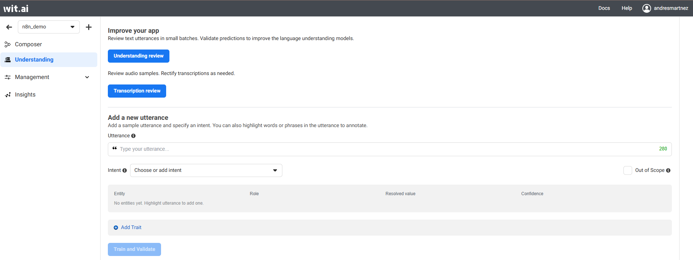

Flujo en n8n.

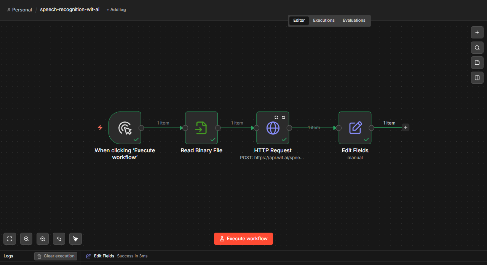


## 03473-AB-test-AI-prompts-with-Supabase-Langchain-Agent.json 

### ¿Qué hace el flujo de trabajo?

Este workflow permite realizar A/B testing de prompts para un chatbot con IA. Cuando llega un nuevo mensaje de chat, el sistema asigna aleatoriamente uno de dos prompts del sistema (baseline o alternativo) a esa sesión de conversación. Una vez asignado, el mismo prompt se mantiene durante toda la sesión, garantizando consistencia en la experiencia del usuario.

El flujo funciona así:

1. Al recibir un mensaje, se definen los dos prompts posibles (baseline y alternativo).
2. Se consulta Supabase para verificar si la sesión ya tiene un prompt asignado.
3. Si la sesión es nueva, se asigna aleatoriamente uno de los dos prompts y se guarda en Supabase.
4. Se selecciona el prompt correspondiente a esa sesión y se inyecta como system message al agente de IA.
5. El agente responde usando GPT-4o-mini, con memoria de conversación almacenada en PostgreSQL.

El prompt que se estableción como baseline_value es el siguiente:

```
You are a customer support assistant. Answer questions clearly and concisely. Always provide accurate information and escalate complex issues when necessary.
```

El prompt alternativo es el siguiente:

```
You are a friendly and empathetic customer support assistant. Always acknowledge the customer's frustration first, then provide a clear and helpful solution in simple language.
```

### Configuración

**Nota importante sobre el archivo JSON:** Al importar el workflow desde el repositorio, se debe tomar únicamente la sección del workflow y eliminar el resto del contenido del JSON. De lo contrario, n8n no cargará nada al intentar importarlo.

#### Supabase

- Crear una tabla llamada `split_test_sessions` con las siguientes columnas:
  - `session_id` — tipo `text`
  - `show_alternative` — tipo `bool`
- Configurar las credenciales usando el **Service Role Secret** (no la clave anon), ya que se necesitan permisos de escritura sobre la tabla.

#### PostgreSQL

- Configurar la conexión con host, puerto, nombre de base de datos, usuario y contraseña.
- Se usa para almacenar el historial de conversación en la tabla `n8n_split_test_chat_histories`, gestionada automáticamente por el nodo de memoria.

#### Prompts

- En el nodo **Define Path Values** se configuran los textos del prompt baseline y el alternativo.
- En el nodo **OpenAI Chat Model** se puede cambiar el modelo o reemplazar el nodo por otro proveedor de lenguaje.

### Evidencias

Conversación de prueba en el chat mostrando la respuesta del agente
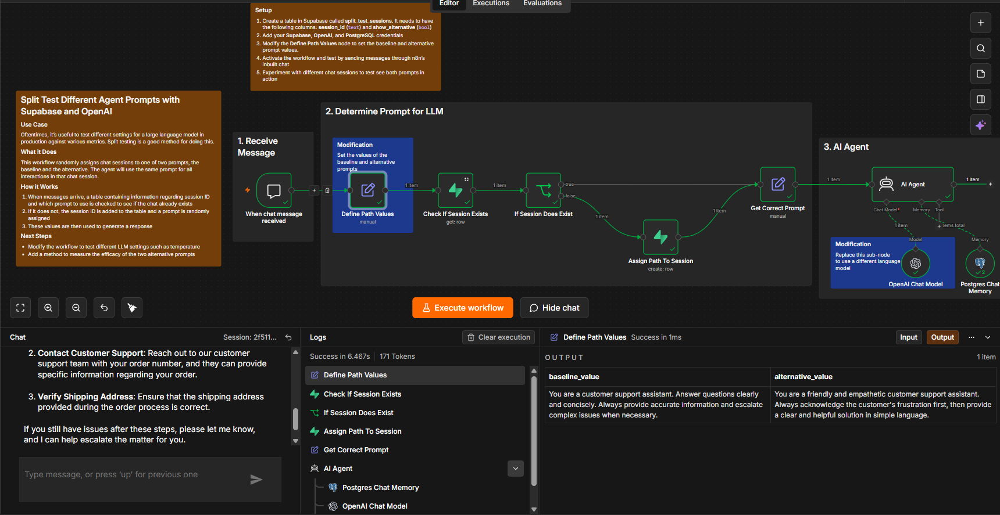

Tabla split_test_sessions en Supabase con sesiones asignadas
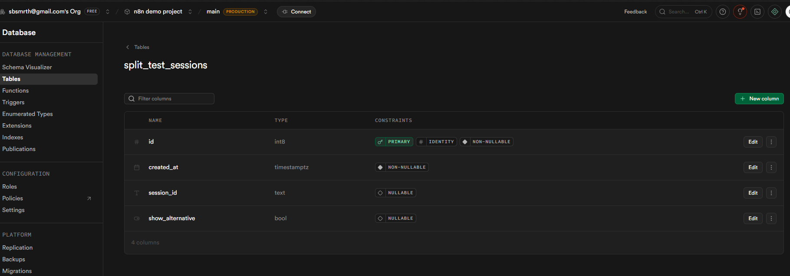


## 0891-rag-github-api-chatbot.json

### ¿Qué hace el flujo de trabajo?

Este workflow implementa un chatbot con técnica RAG (Retrieval-Augmented Generation) que permite hacer preguntas en lenguaje natural sobre una especificación OpenAPI. El proceso se divide en dos partes:

**Indexación:**

1. Se descarga la especificación OpenAPI desde GitHub vía HTTP Request.
2. El contenido se divide en fragmentos usando un splitter de texto recursivo.
3. Se generan embeddings para cada fragmento usando el modelo `nvidia/NV-Embed-v1`.
4. Los embeddings se almacenan en un índice de Pinecone.

**Consulta y respuesta:**

1. El usuario envía un mensaje por el chat.
2. El agente de IA convierte la pregunta en un embedding y consulta Pinecone.
3. Los fragmentos más relevantes se recuperan como contexto.
4. El modelo `gpt-oss-20b` (proporcionado gratuitamente por Nvidia) genera la respuesta final basándose en ese contexto.

### Configuración

#### Nvidia (embeddings y generación)

- Se usa la API de Nvidia como proveedor, compatible con el cliente de OpenAI.
- Obtener una API key desde [build.nvidia.com](https://build.nvidia.com).
- Modelo de embeddings: `nvidia/NV-Embed-v1`.
- Modelo de generación: `gpt-oss-20b` (acceso gratuito ofrecido por Nvidia).
- Configurar las credenciales en n8n como tipo OpenAI, apuntando al endpoint de Nvidia.

#### Pinecone

- Crear una cuenta en [pinecone.io](https://pinecone.io) y obtener una API key.
- Crear un índice llamado `n8n-demo`, o ajustar el nombre en los nodos de Pinecone del workflow.
- El mismo índice se usa tanto para la inserción como para la consulta.

#### Especificación OpenAPI

- El workflow está diseñado para la especificación de la API de GitHub, que se descarga directamente desde su repositorio en GitHub.
- La especificación de GitHub es un JSON muy pesado, por lo que la indexación es lenta y puede tardar varios minutos.

### Evidencias

Carga del workflow
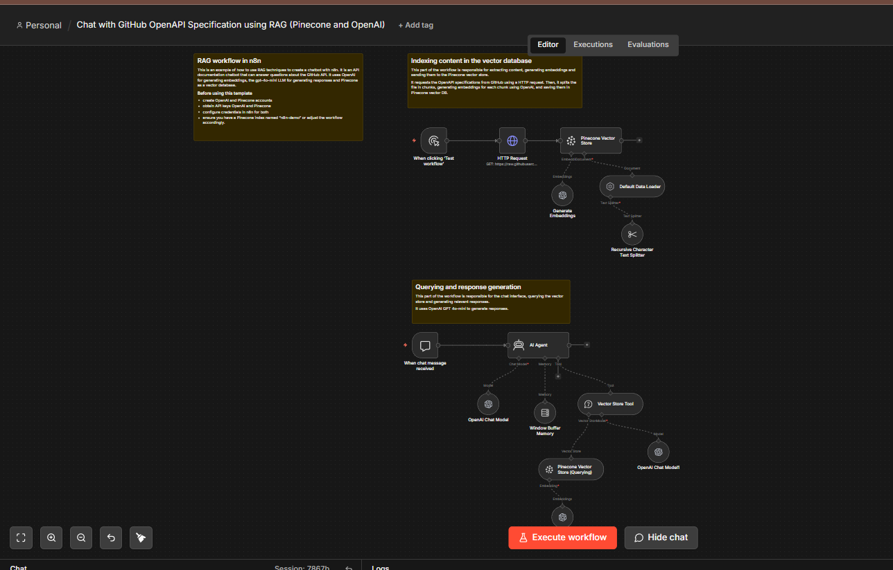

Índice de Pinecone con los vectores almacenados tras la indexación
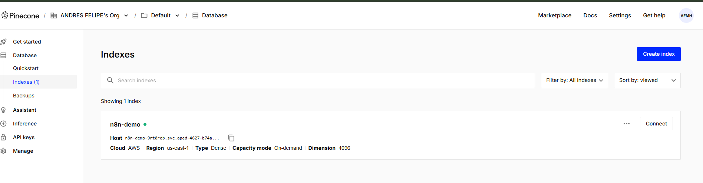

### Notas y limitaciones

- La especificación OpenAPI de GitHub es muy extensa, lo que hace que la indexación sea lenta y en ocasiones genere errores en el nodo de text splitter al recibir el JSON puro.
- Como alternativa se probó con la especificación de Petstore3, que es más liviana y completó el proceso correctamente, aunque el workflow estaba pensado para el contenido de la API de GitHub.
- Si se cambia la fuente de la especificación, es probable que aparezcan errores en el nodo de Recursive Character Text Splitter dependiendo del formato del JSON recibido.

# Workflows de IA

## 01440-auto-categorise-outlook-emails-with-ai.json

### ¿Qué hace el flujo de trabajo?

Este workflow automatiza la clasificación de correos electrónicos de Microsoft Outlook utilizando inteligencia artificial. Su objetivo es analizar los correos entrantes, determinar su categoría según el contenido y organizarlos automáticamente dentro de Outlook.

El proceso funciona de la siguiente manera:

1. Se obtienen los correos de Outlook que no tienen categorías asignadas y que no están marcados.
2. El contenido HTML del correo se convierte a texto limpio para facilitar su análisis.
3. Se extraen datos relevantes como asunto, remitente, importancia y cuerpo del mensaje.
4. Un agente de IA analiza el correo y lo clasifica en una de las siguientes categorías:
   - Action
   - Junk
   - Receipt
   - SaaS
   - Community
   - Business
   - Other
5. La categoría y subcategoría se agregan al correo dentro de Outlook.
6. Dependiendo de la clasificación obtenida, el correo se mueve automáticamente a la carpeta correspondiente.
7. Si el correo requiere acción y ya fue leído, se mueve a una carpeta específica de correos gestionados.

### Configuración

#### Microsoft Outlook

- Crear las credenciales OAuth2 de Microsoft Outlook en n8n.
- Autorizar el acceso a la cuenta de correo para permitir la lectura y modificación de mensajes.
- El workflow utiliza Outlook para:
  - Leer correos entrantes.
  - Actualizar categorías.
  - Mover mensajes entre carpetas.

#### OpenAI

- Configurar credenciales de OpenAI en n8n.
- El workflow utiliza un modelo de chat para analizar el contenido de cada correo y determinar su categoría.
- Durante las pruebas fue necesario reemplazar el modelo original por un modelo de OpenAI para obtener resultados correctos en la clasificación.
- En particular mediante los modelos del marketplace de NVIDIA 

#### Categorías y carpetas

- Verificar que las categorías definidas en Outlook coincidan con las utilizadas en el nodo de IA.
- Ajustar los identificadores de carpetas si se desea mover los correos a ubicaciones diferentes.
- Las categorías disponibles son:
  - Action
  - Junk
  - Receipt
  - SaaS
  - Community
  - Business
  - Other

### Evidencias

Carga del workflow

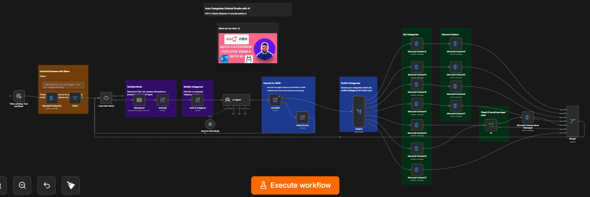

Correos clasificados automáticamente dentro de Outlook:

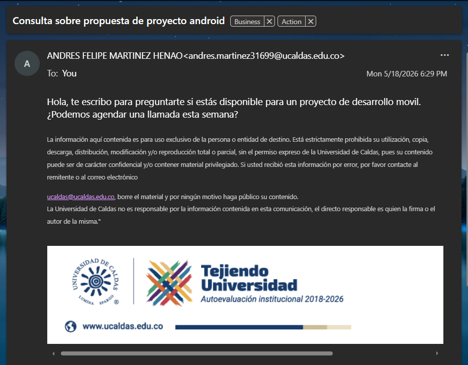

Correos movidos automáticamente a sus carpetas correspondientes:

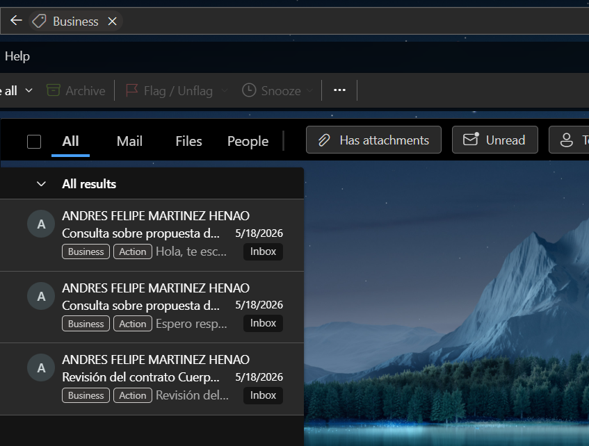


## 00290-feedback-openai-google.json

### ¿Qué hace el flujo de trabajo?

Este workflow tiene como objetivo recopilar comentarios de clientes mediante un formulario web, analizar automáticamente el sentimiento del comentario utilizando un modelo de IA y almacenar tanto la información del formulario como el resultado del análisis en una hoja de cálculo de Google Sheets.

El proceso está diseñado de la siguiente manera:

1. El cliente completa un formulario de retroalimentación.
2. El comentario ingresado se envía a un modelo de lenguaje para realizar análisis de sentimiento.
3. El modelo clasifica el comentario como positivo, negativo o neutral.
4. Los datos originales del formulario y el resultado del análisis se combinan en un único registro.
5. Finalmente, toda la información se almacena en una hoja de Google Sheets para su posterior revisión.

### Configuración

#### Formulario de retroalimentación

- El workflow utiliza un formulario generado desde n8n para recopilar comentarios de clientes.
- El formulario solicita:
  - Nombre del cliente.
  - Categoría de la retroalimentación.
  - Comentario.
  - Información de contacto.

#### OpenAI

- Configurar las credenciales de OpenAI en n8n.
- El flujo utiliza un modelo de lenguaje para determinar el sentimiento del comentario recibido.
- Durante las pruebas se presentaron inconvenientes en el nodo **Message a Model**, mostrando errores relacionados con recursos no encontrados.
- Posteriormente se realizaron ajustes utilizando distintos proveedores y credenciales disponibles en n8n, pero la ejecución continuó presentando problemas de configuración asociados a la obtención de parámetros requeridos por el nodo.

#### Google Sheets

- Crear o seleccionar una hoja de cálculo donde se almacenarán los resultados.
- Configurar las credenciales de Google Sheets en n8n.
- La hoja recibe:
  - Fecha y hora del envío.
  - Categoría seleccionada.
  - Comentario del cliente.
  - Datos de contacto.
  - Resultado del análisis de sentimiento.

### Observaciones

- El flujo no logró completarse correctamente debido a problemas de configuración en el nodo encargado de la interacción con el modelo de IA.
- La integración con Google Sheets y el formulario quedó correctamente estructurada, pero el análisis de sentimiento no pudo ejecutarse de forma exitosa.

### Evidencias

Carga del workflow

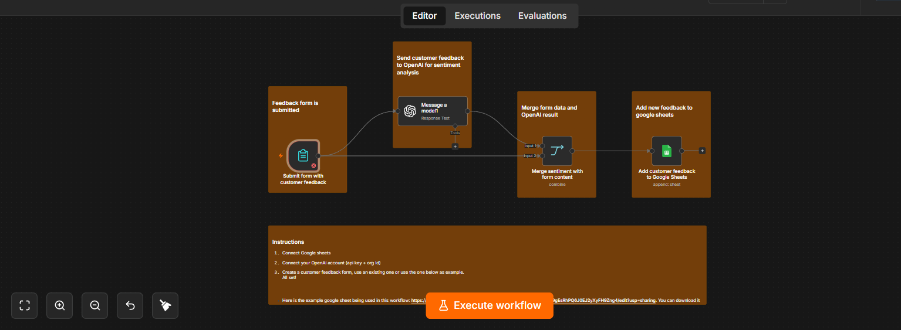

Error presentado en nodo de Formulario

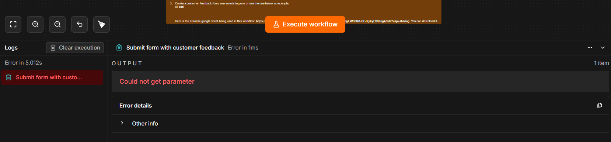


