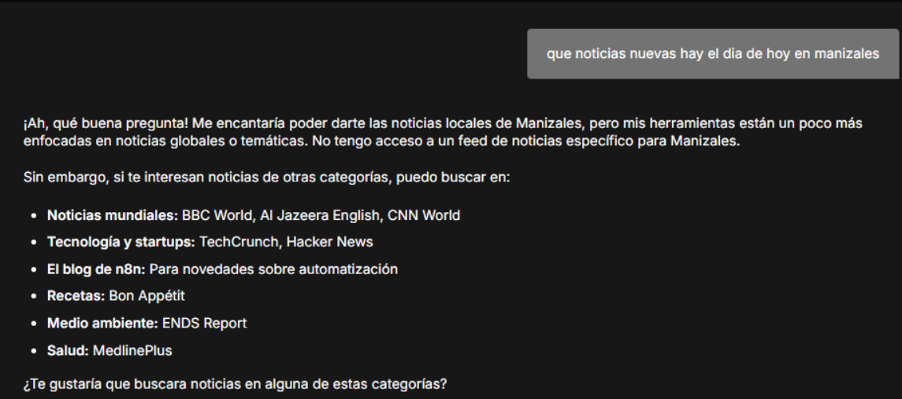
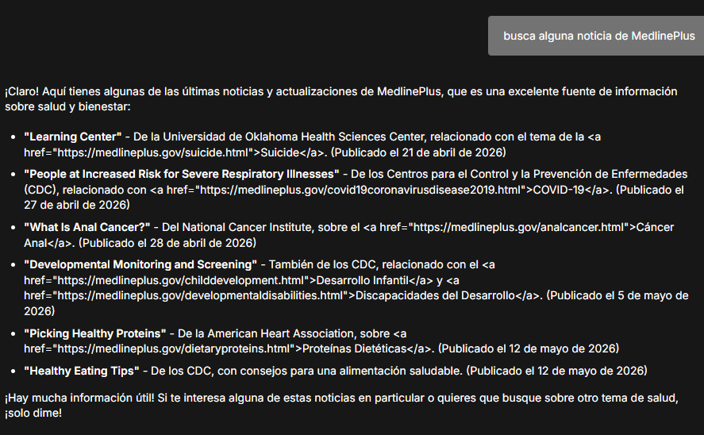
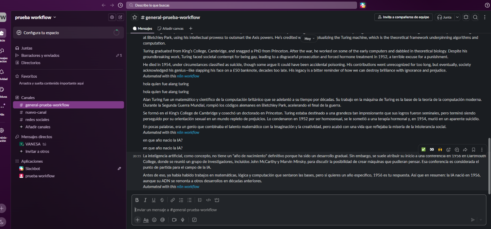
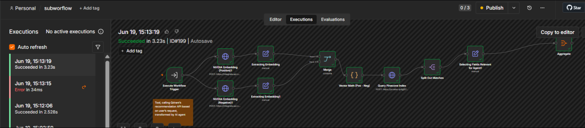
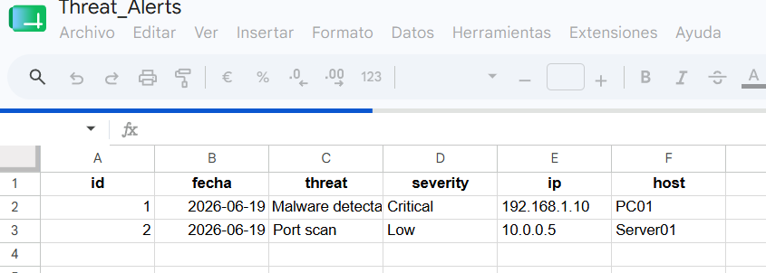
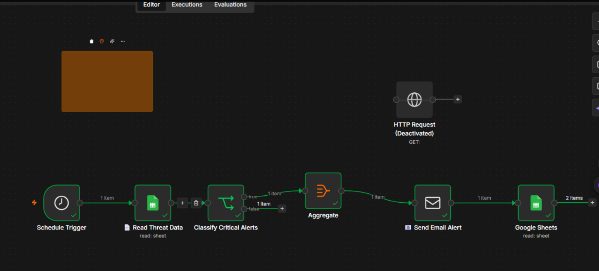

## Evidencias de workflows

Este documento recopila la descripción y las capturas de evidencia de varios workflows de n8n. Cada sección sigue una estructura similar para que la lectura sea más rápida y consistente:

- Descripción general del flujo
- Qué hace el workflow
- Evidencias o pruebas
- Observaciones cuando aplica

---

## 07894-suspicious-login-detection

### Estado
<span style="color:#d32f2f; font-weight:700;">No funcional</span>

### Descripción
El flujo no es funcional principalmente porque tiene componentes críticos apagados (`disabled: true`), como el webhook automático, las consultas a la base de datos Postgres y el envío por Gmail. Eso corta por completo la ruta de análisis histórico. Además, el nodo de condición `Unknown threat?` está incompleto al no definir contra qué comparar las variables de GreyNoise. También hay errores en el mapeo de variables, por ejemplo cuando se usa `context_ip` para un campo guardado como `ip`, lo que causaría que los nodos posteriores procesen datos vacíos y fallen durante la ejecución.

---

## 00853-fine-tuning-openai-with-drive

### Estado
<span style="color:#d32f2f; font-weight:700;">No funcional</span>

### Descripción
Este workflow fue diseñado para automatizar la creación de modelos fine-tuned de OpenAI a partir de un archivo `.jsonl` almacenado en Google Drive. Sin embargo, OpenAI ya no permite crear nuevos trabajos de fine-tuning para organizaciones nuevas, por lo que el nodo `Create Fine-tuning Job` devuelve un error y el flujo ya no puede generar modelos personalizados nuevos. Los modelos fine-tuned creados anteriormente siguen funcionando, pero para proyectos nuevos se recomienda utilizar soluciones RAG con bases vectoriales y documentos.

---

## 07167-deteccion_objetos_gemini

### Estado
<span style="color:#d32f2f; font-weight:700;">No funcional</span>

### Descripción
Este workflow fue diseñado específicamente para Google Gemini por su capacidad de detectar objetos y devolver coordenadas precisas (`bounding boxes`). Se intentó reemplazar Gemini por modelos de visión de NVIDIA para evitar problemas de cuota y acceso, pero estos no generaban las coordenadas necesarias para el resto del flujo, por lo que la detección y el dibujo de las cajas no podían completarse correctamente. Actualmente el workflow requiere acceso funcional a la API de Gemini para operar como fue diseñado.

---

## 09183-build-your-first-ai-agent.json

### Objetivo
Probar e integrar un agente conversacional en n8n que utilice:

- Google Gemini como modelo de IA
- `Get Weather` para consultar Open-Meteo
- `Get News` para leer feeds RSS
- `Conversation Memory` para mantener contexto
- `Chat Trigger` como interfaz de entrada

### ¿Qué hace este flujo de trabajo?
El workflow implementa un agente capaz de:

- Recibir mensajes desde un chat
- Interpretar la intención del usuario
- Seleccionar y ejecutar herramientas automáticamente
- Recuperar información en tiempo real, como clima y noticias
- Responder de forma conversacional manteniendo contexto

### Herramientas y servicios utilizados

- Gemini: razonamiento y generación conversacional
- Open-Meteo: API de pronóstico meteorológico (`https://api.open-meteo.com/v1/forecast`)
- Feeds RSS: BBC, CNN, Al Jazeera, TechCrunch, Hacker News, MedlinePlus, n8n Blog y ENDS Report
- Conversation Memory: conservación de contexto entre mensajes

### Evidencias

#### Prueba 1 - Consulta de clima (`Get Weather`)

**Objetivo:** consultar el clima y pronóstico para Manizales usando Open-Meteo.

**Interacción:**

```text
Usuario: ¿Qué clima está haciendo en Manizales?
Agente: ¿Qué información climática necesita (resumen diario, pronóstico por horas, temperaturas, precipitación)?
Usuario: El pronóstico de hoy.
```

**Resultado:** el agente solicitó aclaración y luego devolvió:

- Temperatura máxima
- Temperatura mínima
- Precipitación
- Condiciones climáticas
- Resumen horario


#### Prueba 2 - Consulta de noticias (`Get News`)

**Objetivo:** validar la lectura de feeds RSS configurados.

**Interacción:**

```text
Usuario: ¿Qué noticias nuevas hay el día de hoy en Manizales?
Agente: No hay feeds locales de Manizales configurados; puedo consultar los feeds RSS disponibles. ¿Qué categoría desea?
```



#### Prueba 3 - RSS específico (MedlinePlus)

**Objetivo:** validar la lectura correcta de un feed RSS funcional (MedlinePlus).

**Interacción:**

```text
Usuario: Busca alguna noticia de MedlinePlus
```



---

## 00286-slack-gilfoyle-chatbot

### Resumen
Integración de Slack con un agente de IA usando n8n y OpenAI. El bot responde automáticamente en canales de Slack, mantiene memoria conversacional por canal y puede usar herramientas externas como Wikipedia y SerpAPI para enriquecer las respuestas.

### Tecnologías utilizadas

- n8n
- Slack API
- OpenAI API (`gpt-4o-mini`)
- SerpAPI
- Wikipedia Tool

### ¿Qué hace el flujo de trabajo?
Implementa un chatbot de Slack con la personalidad de Gilfoyle, que utiliza un agente de IA equipado con `gpt-4o-mini` y herramientas de búsqueda para responder consultas. El sistema comienza con un nodo Webhook que recibe mensajes de Slack, donde un nodo `If` filtra automáticamente cualquier interacción proveniente de bots para evitar bucles. Después, el mensaje del usuario se procesa manteniendo un historial de conversación basado en el ID del canal mediante un nodo de memoria, para finalmente enviar la respuesta generada por la IA directamente al usuario en Slack.

### Funcionamiento general

1. Un usuario envía un mensaje en Slack.
2. Slack envía el evento al webhook de n8n.
3. El workflow valida que el mensaje provenga de un usuario y no de un bot.
4. El mensaje se envía al AI Agent.
5. El agente procesa el prompt con OpenAI y, si es necesario, llama a herramientas externas.
6. La respuesta generada se envía de vuelta al canal de Slack.

### Evidencias

**Mensaje de prueba en Slack:**

```text
@prueba_workflow quien fue alan turing
```

**Resultado:** respuesta generada correctamente por el bot.




---

## 00877-rag-peliculas-recomendacion-qdrant

### Resumen
Este repositorio documenta un sistema de recomendación de películas con enfoque RAG (`Retrieval-Augmented Generation`). El flujo usa n8n como orquestador, OpenAI como agente conversacional y Qdrant como base de datos vectorial.

### ¿Qué hace este flujo?
Este flujo tiene dos partes: la primera carga el Top 1000 de películas IMDB desde GitHub, extrae el CSV, genera embeddings con `OpenAI text-embedding-3-small` y almacena los vectores con metadatos como nombre, año y descripción en Qdrant. La segunda expone un chatbot con `GPT-4o-mini` que recibe mensajes del usuario, interpreta su solicitud extrayendo un ejemplo positivo y uno negativo, genera embeddings para ambos en paralelo, llama directamente a la API de recomendación de Qdrant usando la estrategia `average_vector`, recupera los metadatos de los 3 resultados y devuelve las top 3 películas recomendadas ordenadas por score sin mostrárselo al usuario.

### Arquitectura del workflow

El sistema se divide en dos partes:

1. **Flujo principal conversacional.** Recibe el mensaje del usuario en el chat, lo interpreta con el Agente de IA y extrae datos clave como el tipo de película y el año, si se menciona.
2. **Subflujo de recomendación.** Recibe los parámetros estructurados, genera embeddings, consulta Qdrant con filtros como `release_year` y devuelve las coincidencias más relevantes.

### Evidencias




---

## 09308-Automate-security-incident-response

### Resumen
Este workflow en n8n automatiza la detección y notificación de alertas de seguridad críticas a partir de datos almacenados en Google Sheets.

El sistema revisa periódicamente registros de amenazas, filtra eventos con severidad `Critical`, agrupa los resultados y envía notificaciones por correo electrónico con la información relevante.

### ¿Qué hace el flujo de trabajo?
Este flujo se ejecuta automáticamente por un trigger programado, lee alertas de seguridad desde una hoja de Google Sheets proveniente de una clasificación previa con GPT, filtra únicamente las alertas con severidad crítica, las agrega, envía un correo de alerta con formato HTML personalizado, registra todos los detalles en una hoja de incidentes centralizada y, opcionalmente, con un nodo deshabilitado, envía una solicitud POST a una API de EDR como CrowdStrike para aislar el endpoint comprometido.

### Arquitectura del workflow

1. **Schedule Trigger**
   - Ejecuta el workflow de forma periódica.

2. **Read Threat Data (Google Sheets)**
   - Lee los datos almacenados en la hoja de cálculo `Threat_Alerts`.

3. **Classify Critical Alerts**
   - Filtra únicamente los registros con `severity = Critical`.

4. **Aggregate Node**
   - Agrupa los eventos críticos en un solo conjunto de datos para su procesamiento.

5. **Send Email Alert**
   - Envía una notificación por correo electrónico con los eventos críticos detectados.

6. **Google Sheets (Output / Logging)**
   - Registra o actualiza información después del envío del correo.

### SMTP Email

**Uso:** envío de alertas por correo electrónico.

**Configuración:**

- SMTP Host, por ejemplo `smtp.gmail.com`
- SMTP Port, por ejemplo `587`
- Username del correo emisor
- Password o App Password

### Estructura esperada en Google Sheets

La hoja de cálculo `Threat_Alerts` debe contener al menos:

| timestamp | severity | message | source |
| --- | --- | --- | --- |
| 2026-06-19 | Critical | SQL Injection detected | WAF |

### Evidencias


Ejemplo del documento de Google Sheets.





